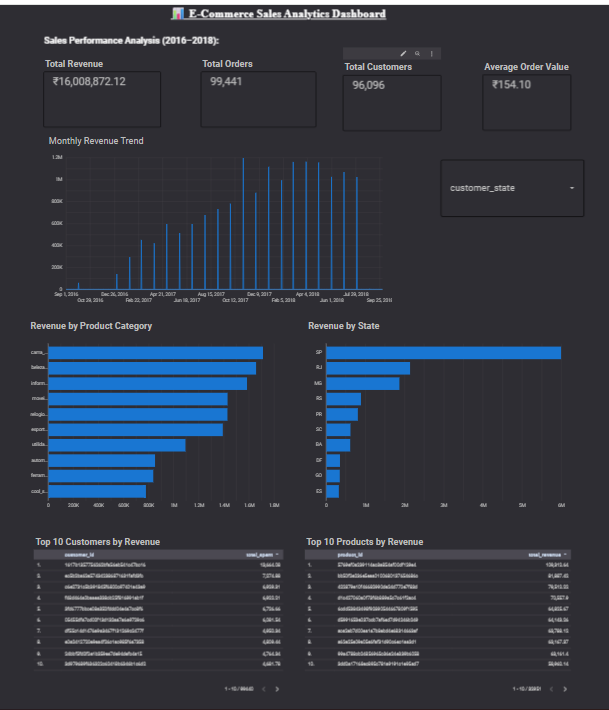

# 📊 E-Commerce Sales Analytics Dashboard

## 📌 Project Overview

This project analyzes an e-commerce dataset using **Google BigQuery** and visualizes business insights with **Looker Studio**.

## 🚀 Technologies Used

- SQL
- Google BigQuery
- Looker Studio
- GitHub

## 📈 Key Dashboard Metrics

- 💰 Total Revenue
- 📦 Total Orders
- 👥 Total Customers
- 💳 Average Order Value
- 📅 Monthly Revenue Trend
- 🛍 Revenue by Product Category
- 🌍 Revenue by State
- 👤 Top 10 Customers
- 📦 Top 10 Products

## 📷 Dashboard Preview



## 📂 Project Structure

```text
dashboard/
sql/
README.md
LICENSE
```

## 📊 Dataset

Brazilian Olist E-Commerce Dataset

## 👨‍💻 Author

Mohammed Saleem Shaik
